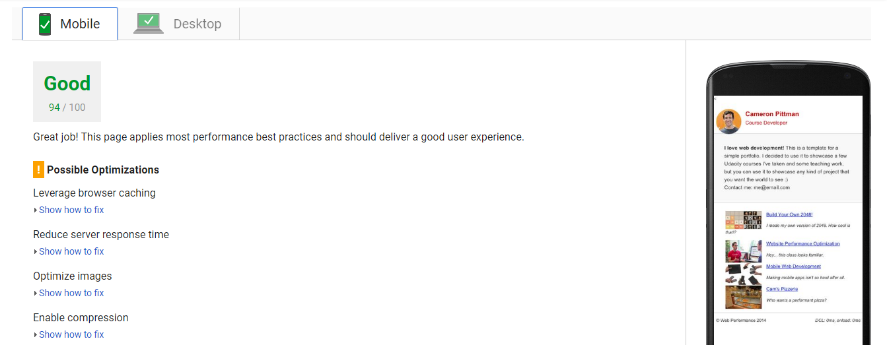
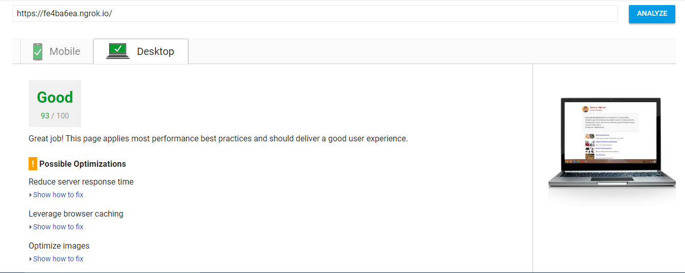

visit https://ashokviswa96.github.io/Perf-Matters/ for the live version of this.

# How to run local server and use PageSpeed Insights
* Download and Install NodeJS from https://nodejs.org and install using all the default options.
* Install the http-server package from npm
* Install the http-server globally on your machine using the node package manager (npm) command line  tool, this will allow you to run a web server from anywhere on your computer.
* Change to the directory containing your static web files (e.g. html, javascript, css etc) in the command line window, e.g:
```
cd \projects\angular-registration-login-example
```
Start the server with this command:
```
http-server
```
You should see something like the following:
```
C:\projects\angular-registration-login-example>http-server
Starting up http-server, serving ./
Available on:
  http://192.168.0.5:8080
  http://127.0.0.1:8080
Hit CTRL-C to stop the server
```
* Open your browser and go to the address http://localhost:8080 and you should see your local website.
* Download and install ngrok to the top-level of your project directory to make your local server accessible remotely.
```
 cd /path/to/your-project-folder
./ngrok http 8080
```
* Copy the public URL ngrok gives you and try running it through PageSpeed Insights!.

# Optimizations Done
## Part 1: Optimize PageSpeed Insights score for index.html

steps I took to increase the score above 90 are as follows:
  * Eliminated render-blocking CSS:
      * Added the media="print"  attribute for the external style sheet for print styles.
      * Inlined the CSS by including it into the HTML document.
  * Eliminated render-blocking JavaScript by adding the HTML async attribute to GA script.
  * Optimised the images used on the page .
  * Added media="none" attribute for fonts.

  After making changes the score increased to 94/100 for mobile and 93/100 for desktop.
  
  

## Part 2: 60FPS in pizza.html

```javascript
document.addEventListener('DOMContentLoaded', function() {
  var cols = 8;
  var s = 256;
  var screenheight=window.screen.height;
  var pizzacount = screenheight / s* cols;
  //calculated the number of pizzas to match the screen size.
  for (var i = 0;i<pizzacount;i++){
    var elem = document.createElement('img');
    elem.className = 'mover';
    elem.src = "images/pizza.png";
    //moved height and width properties to style.css
    elem.basicLeft = (i % cols) * s;
    elem.style.top = (Math.floor(i / cols) * s) + 'px';
    //changed querySelector to getElementById.
    document.getElementById("movingPizzas1").appendChild(elem);
  }
  updatePositions(0);
});
```
The steps I took to improve the number of frames per second are:
    * reduced the number of pizzas to match the screen size.
    * Moved the height and width properties to .mover in style.css in order to reduce paint events.
    * used `document.getElementById` instead of `querySelector`.
    * Added `Backface-visibility: hidden;` property to css to define the visibility of the element.  
    * Made changes to the `updatePositions` function below as follows:
        *  moved the `document.body.scrollTop/1250` outside the function and passed it as a parameter.  
        *  used `getElementsByClassName` instead of `querySelector`.
    * optimised animation by using `requestAnimationFrame` on scrolling .The callback function `updatePositions` is passed within a anonymous function since it has `phasevar` passed. This is done to overcome the forced syncronous layout when the pizzas are generated at first.

    ```javascript
    window.addEventListener('scroll', function (){
      //moved phasevar here to avoid forced syncronous layout when the sliding pizzas are generated on DOM load.
      var phasevar =document.body.scrollTop / 1250;
      //using request animation frame to optimize animation
      //the updatePositions function is passed within a anonymous
      //function sinse it has phasevar passed.
      requestAnimationFrame(function(){
        updatePositions(phasevar);
      });
    });
    ```

##Part 3: Reducing the Time to resize pizzas

```javascript
function changePizzaSizes(size) {
  //moved the variables outside the loop.
  //changed querySelectorAll to getElementsByClassName to improve performance.
  //moved the variables outside the loop
  var newPizza = document.getElementsByClassName("randomPizzaContainer");
  var dx = determineDx(newPizza[0], size);
  var newwidth = (newPizza[0].offsetWidth + dx) + 'px';
  for (var i = 0; i < newPizza.length; i++) {
    newPizza[i].style.width = newwidth;
  }
}
```
  * moved variable `dx` and `newwidth` outside the loop .
  * created `newPizza` to hold elements with class name `randomPizzaContainer`.
